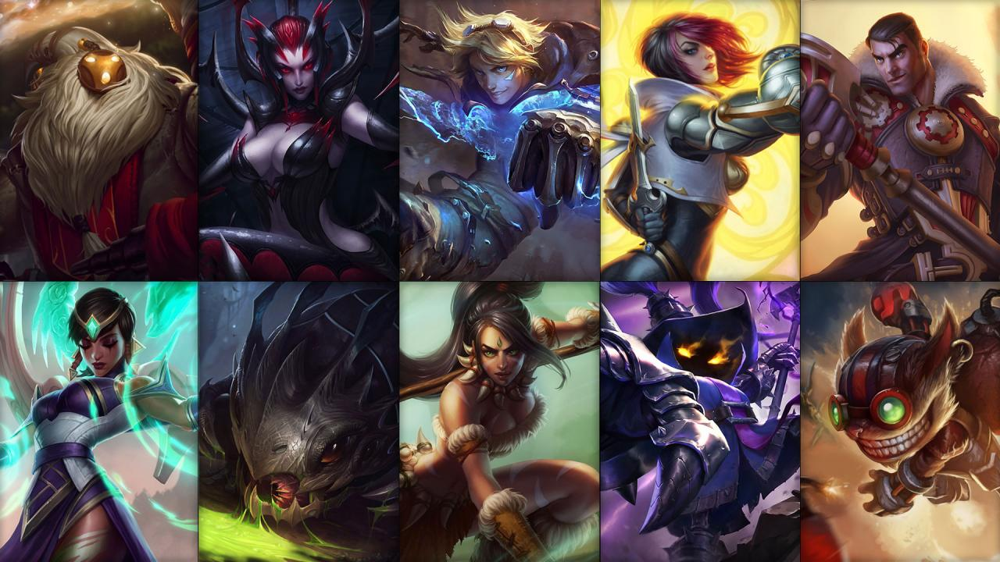

<h1>
League of Legends - Determinants of Match Outcomes Utilizing Player Stastistics
</h1>
 

---

## Problem Statement

The world of eSports have spearheaded into the mainstream with multiple tech companies such as AMD and Intel jumping into the scene with sponsors and promotions to expand its presense throughout the digital culture. With so many players trying to participate, one must first earn their title by claiming victory. Whether a player is attempting to attract viewers for their brand or a broadcast is narrating a match, we cannot deny that decisions made by players can be analyzed on a macro and micro level to predict the outcome of a match. Here, we want to take those statistics into account and attempt to build a model as well as discover which factors are the most important in determining an outcome of a match by examining team objective completes and individual player statistics.

## Relevent Files
* [Notebook](https://git.generalassemb.ly/tempyst/capstone/blob/master/code/League%20of%20Legends.ipynb)
* [Data Gather](https://git.generalassemb.ly/tempyst/capstone/blob/master/code/API%20Data%20Gathering.ipynb)
* [Images](https://git.generalassemb.ly/tempyst/capstone/tree/master/images)
* [Graphs](https://git.generalassemb.ly/tempyst/capstone/tree/master/graphs)

---

#### Description of the Game
Below is a map of "Summoner's Rift", the standard arena that players interact with each other. The game is a 5 vs. 5 match with the primary objective of destroying your opponent's base (Nexus). The game is comprised with 3 lanes (Top, Middle, and Bottom) with a wildcard role of being the "Jungler" that roams randomly into their opponents territory to scout or ambush said opponents. The game is played with an isometric view in a point and click environment. There are four main keys (Q, W, E, R) for main champion skills and two summoner skills (D and F keys) which can be customized as the player chooses. Below are two example gameplay screen shots:
[source](https://medium.com/@itsjadaknight/your-product-team-is-a-professional-esports-team-b43d5afa4a3)

---

#### Champions

League of Legends is a type of game called *Massive Online Battle Arena* (MOBA) where players are connected to a server to "battle" other players of the opposing team. In this game, a player only needs to control one champion which are given a set of skills to be utilized in the match. Example of Champions are shown below:

From Top left: Bard, Elise, Ezreal, Fiora, Jayce, Karma, Kog Maw, Nidalee, Veigar, Ziggs

---

## Executive Summary

We want to load our collect data from a different notebook to begin our analysis of player statistics. As with most datasets, we have to assume that the data will need to be cleaned and formatted before we begin any exploratory analysis. In addition, we need to import all relevant libraries. Our goal is to build a predictive model with the target as being victorious for any match. We quickly see that the data has categorical values as well as many missing values. Since we do cannot impute unknown values, some of the features as well as data points were removed. For the categorical data, we either convert the values from boolean into binary representations or create dummified features to properly account for their data. We also want to identify outliers and make a decision to either include or exclude those values in our model. While it many would consider removing outliers, we decided to keep the outliers and see if our model will perform well even if we have a tiny population of the data showing expected behavior. 

After cleaning the data, we were curious on how players actually perform. We analyzed the distribution of primary player statistics such as kill and death scores obtained through their matches in aggragate. We then looked at the distribution of player ranks from our data. This is important because a player's skill is generally measured by their rank which can affect the win rate distribution. We have to be wary however, that not all players are assumed to play at full strength at all times and occasionally grieving can happen if team morale or attitude heads toward the negative side. With two different analysis examined, we can combined both data and show the average statistics across all ranks. This gives us a general idea of how risk averse or risk-seeking players are. Depending on situation, taking big risks can lead to positive results which can facilitate a victory. However, make the wrong choice and that can cost you the game. We move onto examining champion choices for players per lane choice.

For players familiar with the game, players are able to choose between four roles: Top Lane, Middle Lane, Bottom Lane, or roam in the Jungle (as shown above). Some champions have an absolute popular pick because of the current patch favors their skill set. We recognize that the champion picks between the lanes show little variety and did not offer much information. We proceed to identify champion choices per player rank. Once again we witness the stagnation in variety for choices which is not surprising. Standard players rather high or low ranked, have a tendency to imitate professional players in champion choices. When we noticed the champion choices were not changing, we decided not to examine players in the Diamond, Master, and Challenger ranks because we suspect the top champions will most likely be the same.

Next we want to examine the origin statistics, mainly the kill, death, and assist score specifically, the ratio between them. If a player receives a lot of deaths in any match, there is a high chance that team will lose the match. The negative effect is twofold: by dying, you reward your opponent with resources (gold) in which they will purchase items to increase their strength. In addition, if that player is taken out of play for a specific amount of time (respawn timer) then the game is suddenly lopsided, turning the map into a potential 4 v 5 or even worse. Lastly, if the death occured in laning phase (during the first time minutes of the game) it enables the enemy to steal resources within your team's jungle. One of the many reason players are very attentive to their kill-death-assist ratio is because it shows their decision making and map awareness skills. These factors have a high impact when attempting to lead their team to victory.

With the analysis complete, we attempt to group the KDAs and Dominance factor into their clusters using KMeans. This can potentially give us additional information as a feature and our model can learn better during the modeling phase. 

With all the analysis complete, we proceed with feature engineering. Since we have a lot of categorical data, we need to represent them as a feature properly. We do this by applying the `pd.get_dummies()` method to turn all the categorical data into binary features. We must not forget we must do the same for the clusters we previously created. This is imperative because the clusters, even though are numerical ranges, do not have any ordinal properties. If we simply leave that feature as is, the model will treat it as an ordinal data.

We then proceed with the modeling phase and setting a baseline score. We observe that the score is about 50% which means that if we were to randomly guess an outcome, we should be right half of the time. With this in mind, we need our model to perform better than this otherwise a random guess is more accurate than the model.

There are a few models we wanted to try including at least one neural network model. We want to optimize for specificity here because a false positive would give false hope for players that think they can win while in reality, the match is lost. On the other hand false negatives would not be a detrimental result because, who would complain if they actually won when they were expected to lose. With that said, our models will be classification types with accuracy as our main metric. 

There are some limitations for this dataset. As presented herein, we discovered that the distribution of player ranks were not even. In fact, the majority of the players appear to be Diamond ranked. While Diamond ranked players are quite skilled, we would not have proper representation of the other ranks and it is possible the statistics discovered here would not apply to other ranks. In addition, this set of data only applies to the North American Region with a specific patch of 9.15. Because the world of eSports require constant dynamic adjustments to the game to maintain interests, our analysis might be outdated by next patch (at the time of this writing, the game is on patch 9.16).

---

## Conclusion and Recommendations

Our goal was to build a predictive model to determine the outcome of a particular match with a great deal of accuracy and we have successfully completed this task. With so much information collected from Riot, we believe that our model has learned the which feature was the most important in determining an outcome and it was the metric that most eSports analyst pay attention to: Kill-Death-Assist Ratio. In addition to that, destroying structions (turrets and inibitors) seems to have a strong affect in contributing to a victory because it would impact your opponent's psychology with a feeling of dread when their team is falling behind. Mental state is an important factor to remember whenever a competition between two groups is happening and any form of shock or unexpected events can lead to morale change. Unfortunately mental state is not something we can measure; we can only infer the effects of how a player reacts when introduced to these statistics during a game. Lastly, we discovered that the second cluster was another huge factor in determining a player's outcome. The second cluster assigned using KMeans was determined to be players that were lagging in terms of positive contribution. In fact, it appears KMeans has detected that these players were "bad players" and thus, had no chance of victory. 

For players out there that are trying to improve their gameplay and odds of victory, be mindful of your risk assessment. Scoring a death count against your favor can have huge negative impacts in your games. For the past 10 years of this game's existence, the style of playing has changed a few times. Most of the changes were influenced by updates released by Riot but the player themselves are constantly trying to find new ways to make the game interesting. We believe that at the end of the day, having fun is the most important factor and enjoying the competition is the best reward.

## Future Prospects and Going Forward

Because the data is limited to the North American region, addition data is needed to analyze other regions or all regions combined as a whole. A vast amount of data would need to be collect and more computing power to analyze. Our next step is to see if Riot will allow us to register for a production level API so our request limit is lifted where we can retrieve mass amount of data in a short amount of time. In addition, we plan on using Amazon Web Services to analyze the data since conventional computing power is no longer sufficient. We wish to create a model on a global scale to hopefully get a better picture at how all players across the globe is performing.

## Relevent Sources
- [Riot Games](https://na.leagueoflegends.com/en/)
- [API](https://developer.riotgames.com/)
